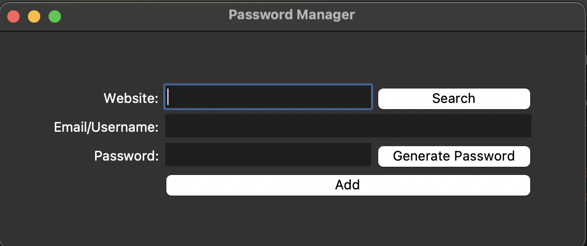

# 🔐 Password Manager

A beginner-friendly Python desktop app to generate and store secure passwords locally using a simple graphical user interface (GUI).

## ✨ Features
- Generate strong random passwords.
- Save and store credentials (website, email, password).
- Search and retrieve saved credentials.
- Copy passwords to clipboard.
- Local storage in JSON format.

## 🖼️ Preview

<p align="center">
  
</p>

## 🛠️ Technologies Used
- Python 3
- `tkinter` for GUI
- `json` for file handling
- `pyperclip` for clipboard support

## ▶️ How to Run
1. Make sure Python is installed.
2. Install pyperclip:
   ```bash
   pip install pyperclip
